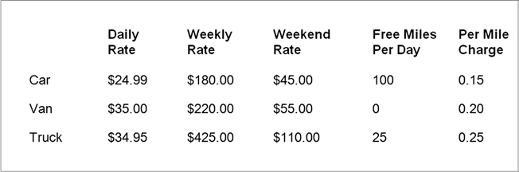

# Vehicle Rental Agency Program
Design, implement, and test a program that will serve the needs of a vehicle 
rental agency.

The Problem
===========
Develop an object-oriented design and implementation of a program capable of maintaining 
reservations for a vehicle rental agency.
The agency rents out three types of vehicles;
<ul>
    <li>Cars</li>
    <li>Vans</li>
    <li>Moving trucks</li>
</ul>

Features: The program should allow users to; 
<ul>
    <li>Check for available vehicles</li>
    <li>Request charges by vehicle type</li>
    <li>Get cost of renting a particular type vehicle for a specified perion of time</li>
    <li>Make/cancel reservations</li>
</ul>

Problem Analysis
=================
The program needs an appropriate set of objects for the vehicle rental agency domain. 
<dl>
    <dt>
        <code>Vehicle</code> class: maintains info common to all vehicle types
    </dt>
        <dd>miles-per-gallon rating</dd>
        <dd>vehicle identification number (VIN)</dd>
    <dt>
        Subclasses of the <code>Vehicle</code> class can maintain information specific to each subtype.
    </dt>
    <dt>
        <code>Car</code> subclass: contains info (instance variables and/or methods) specific to that <code>Car</code> vehicle type.
    </dt>
        <dd>make</dd>
        <dd>model</dd>
        <dd>number of doors</dd>
        <dd>capacity (passengers)</dd>
    <dt>
        <code>Van</code> subclass: contains info (instance variables and/or methods) specific to that <code>Van</code> vehicle type.
    </dt>
        <dd>make</dd>
        <dd>model</dd>
        <dd>capacity (passengers)</dd>
    <dt>
        <code>Truck</code> subclass: contains info (instance variables and/or methods) specific to that <code>Truck</code> vehicle type.
    </dt>
        <dd>length</dd>
        <dd>cargo space</dd>
    <dt>
        <code>VehicleCost</code> class: For each type vehicle, there is;
    </dt>
        <dd>rental charge based on daily, weekly, and weekend rental rates</dd>
        <dd>mileage charge and some number of free miles (on select vehicles)</dd>
        <dd>cost of optional insurance</dd>
    <dt>
        <code>Reservation</code> class: maintains the information for each reservation made
    </dt>
        <dd>customer name</dd>
        <dd>address</dd>
        <dd>credit card numbere</dd>
        <dd>VIN of the vehicle rented</dd>
</dl>

Program design - Program requirements
==============
The program must maintain a group of specific vehicles for the following vehicle cartegories:
cars, vans, and (moving) trucks with the following characteristics:
<ul>
    <li>Cars: make/model, miles-per-gallon, num of passengers, num of doors, VIN</li>
    <li>Vans: make/model, miles-per-gallon, num of passengers, VIN</li>
    <li>Trucks: miles-per-gallon, length, number of rooms, VIN</li>
</ul>
The program must be able to dispaly  the specific vehicles available for rent by vehicle type.

The program must dispaly the cost associated with a given type vehicle including daily,
weekend, weekly rate, insurance cost, mileage charge, number of free miles.

It must also allow the user to determine the cost of a particular vehicle, for a given
period of time, an estimated number of miles, and the cost of optional insuatance.

The program must be able to allow a particular vehicle to be reserved and cancelled.

